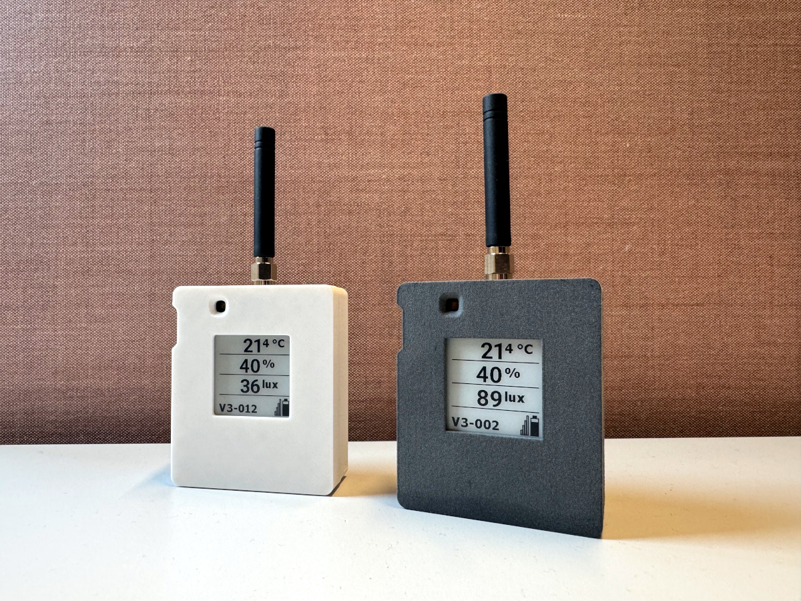

# MuMo

> **Note:** This project was completed at the end of 2025 and will be continued as an organization on GitHub (https://github.com/MuseumMonitoring). This repository serves as a report of the finished project and documents its achievements.

MuMo stands for 'Museum Monitoring (Tool)'. The project has the ambition to open up datalogging in museums, a crucial prerequisite for the preventive conservation of heritage, and to offer an alternative end-to-end solution. This is done by looking at each link in the datalogging chain in an unbiased way and by building our own system using open hardware and software solutions that truly makes 'open data' out of the data generated by the datalog system.

With the MuMo project, we built a modular and open datalog system that delivers high-quality and interoperable data. This project includes two elements:

1. **Dataloggers** that monitor storage conditions with high quality and allow these measurements to flow through to a web-based dashboard. All elements in this system are realized using open hardware & software and/or according to the principles of open design, and the entire datalog system is shared with an open license (MIT license), so that the project result can be used/edited by anyone without restrictions, but also without warranty conditions.

2. **Data Management** - To sustainably manage the data from the MuMo dataloggers and to facilitate sharing data outside one's own data silo, we built further on the ideas of the Flemish Smart Data Space (https://www.vlaanderen.be/vlaamse-smart-data-space-portaal).

This project is licensed under the **MIT License** 

## Dataloggers

The project iteratively developed two versions of dataloggers:

### Version 3 - Standard Logger
The V3 logger features an e-paper screen for on-device data visualization. The hardware consists of two modular PCBs:
- **[Main PCB](https://github.com/Strooom/LoRa-V3-PCB)** - The core LoRa-enabled board
- **[Sensor PCB](https://github.com/Strooom/LoRa-V3-Sensor-PCB)** - A small board with sensors that plugs into the main PCB. This modular design enables easy replacement with calibrated sensors or upgrades to newer sensor models.

*MuMo V3 standard dataloggers with e-paper displays showing temperature, humidity, and light measurements*

### Version 3 Mini
A compact version of the datalogger without the e-paper screen, designed for space-constrained installations.
- **[Hardware repository](https://github.com/Strooom/LoRa-V3-Mini-PCB)**

Both versions share the same firmware, ensuring consistent functionality and streamlined maintenance across the deployment.
- **[Firmware repository](https://github.com/Strooom/MuMo-v2-Node-SW)**

## Data Management

The MuMo data management system consists of two layers:

### PHP Dashboard
Built further from Version 1, the dashboard is a PHP-based application with MySQL/MariaDB that serves as the primary data ingestion and management interface. The latest version includes:
- Handling of more complex data structures
- Group and user management capabilities
- Event logging system for timestamped events (e.g., "window was left open from XX to YY")
- **[Dashboard repository](https://github.com/MuseumMonitoring/dashboard)**

### Interoperable Data Pipeline
On top of the standard dashboard, an interoperable pipeline was built following data space principles. This pipeline enables data sharing across system boundaries using:
- **SOLID** - Solid pods for decentralized data storage and authentication for secure access
- **LDES** - Linked Data Event Streams for publishing and consuming data streams
- **[Data model primer](https://github.com/MuseumMonitoring/mumo-primer)** - A comprehensive primer documenting the semantic data structure
- **[Pipeline repository](https://github.com/MuseumMonitoring/pipeline)**
- **[Graphs dashboard](https://github.com/MuseumMonitoring/graphs)** - Semantic data querying interface

This architecture aligns with the Flemish Smart Data Space principles, ensuring true data interoperability.

## Repository Overview

| Component | Technology | Repository | Description |
|-----------|------------|------------|-------------|
| **V3 Main PCB** | PCB Design | [`LoRa-V3-PCB`](https://github.com/Strooom/LoRa-V3-PCB) | Standard logger main board with e-paper screen |
| **V3 Sensor PCB** | PCB Design | [`LoRa-V3-Sensor-PCB`](https://github.com/Strooom/LoRa-V3-Sensor-PCB) | Modular sensor board for V3 logger |
| **V3 Mini PCB** | PCB Design | [`LoRa-V3-Mini-PCB`](https://github.com/Strooom/LoRa-V3-Mini-PCB) | Compact logger without screen |
| **Firmware** | C++ | [`MuMo-v2-Node-SW`](https://github.com/Strooom/MuMo-v2-Node-SW) | Shared firmware for all V3 loggers |
| **Dashboard** | PHP, MySQL | [`dashboard`](https://github.com/MuseumMonitoring/dashboard) | Admin interface and data ingestion |
| **Data Pipeline** | Javascript, RDF | [`pipeline`](https://github.com/MuseumMonitoring/pipeline) | Semantic data transformation |
| **Graphs Client** | Svelte, Solid | [`graphs`](https://github.com/MuseumMonitoring/graphs) | Semantic data querying interface |
| **Deployment** | Docker, nginx | [`mumo-platform`](https://github.com/MuseumMonitoring/mumo-platform) | Deployment repository with docker-compose files and nginx configs |
| **Data Model** | RDF, OWL | [`mumo-primer`](https://github.com/MuseumMonitoring/mumo-primer) | Primer into the semantic data model |

---

For information about earlier versions (V1 and V2), see [docs/older-versions.md](docs/older-versions.md).

